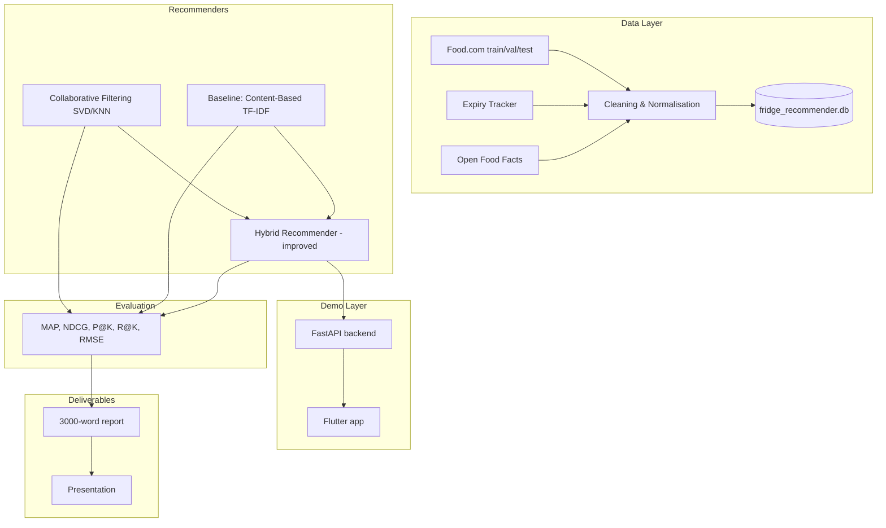

# FridgeWise AI

A hybrid recipe recommendation system for food waste reduction using expiry dates, fridge ingredients, nutrition data, and personalized recipe suggestions.

**Module:** B9AI103 Recommender Systems (CA ONE — 60%)  
**Pitch:** FridgeWise AI combines collaborative filtering and ingredient-based matching, re-ranked by expiry urgency and nutrition data, to reduce food waste — with cold-start fallbacks for new users and unfamiliar ingredients.

---

## Assignment Alignment

| Part | Weight | Focus | Status |
|------|--------|-------|--------|
| **Part 1** — System design & implementation | 35% | Two+ distinct recommenders, preprocessing, hybrid as improved model | Implemented |
| **Part 2** — Evaluation & cold-start | 40% | MAP, NDCG, offline evaluation, cold-start mitigation | Pipeline ready; tune & report |
| **Part 3** — GenAI analysis & presentation | 25% | Compare GenAI vs traditional RS; 10–15 min presentation | Report/presentation TBD |

**Deliverables:** Group report (max 3,000 words, PDF on Moodle), code repository, group presentation (10–15 minutes).

**AI use (DBS policy):** AI may be used for brainstorming, structuring, and planning. The **final submitted report must be written in your group's own words** and properly referenced. Use this README as an internal blueprint only.

---

## Project Overview

FridgeWise AI recommends recipes using:

1. **Food.com** — recipes, ratings, and offline evaluation (core dataset)
2. **Fridge context** — synthetic inventory for the app demo; user profile ingredients for content-based evaluation
3. **Expiry priority** — re-ranking signal from the Food Expiry Tracker dataset
4. **Nutrition / barcode data** — Open Food Facts for allergens and nutrition-aware ranking in the app

### Data roles (simplified)

| Source | Role in project |
|--------|-----------------|
| [Food.com](https://www.kaggle.com/datasets/shuyangli94/food-com-recipes-and-user-interactions) | **Core** — CF, content-based features, train/val/test evaluation |
| [Food Expiry Tracker](https://www.kaggle.com/datasets/prekshad2166/food-expiry-tracker) | **Supporting** — expiry priority logic and report discussion |
| [Open Food Facts API](https://openfoodfacts.github.io/openfoodfacts-server/api/tutorial-off-api/) | **Supporting** — barcode screen, nutrition score, allergen filtering |

**Integration note:** Datasets share no common ID. Integration uses cleaned, normalised ingredient names and product-to-ingredient mapping (`src/preprocessing/ingredient_utils.py`).

**Report framing:** *"Food.com drives offline evaluation; expiry and nutrition are re-ranking signals in the hybrid model and Flutter demo."*

---

## Architecture



---

## Repository Structure

```
FridgeWise-AI/
├── api/
│   └── main.py                 # FastAPI backend for Flutter
├── config/
│   └── config.yaml             # Paths, weights, evaluation settings
├── data/
│   ├── raw/                    # Kaggle downloads (gitignored)
│   ├── processed/              # Clean CSVs + evaluation_results.json
│   └── fridge_recommender.db
├── flutter_app/                # Flutter prototype (demo only)
│   └── lib/
├── scripts/
│   ├── build_dataset.py        # Full data pipeline
│   ├── train_and_evaluate.py   # Offline evaluation
│   ├── download_data.py
│   └── verify_database.py
├── src/
│   ├── preprocessing/          # Cleaning, integration, ingredient utils
│   ├── models/                 # Content-based, CF, hybrid
│   └── evaluation/             # MAP, NDCG, metrics
├── requirements.txt
└── report/                     # Figures & outline (report in own words)
```

---

## Recommender Models

### Model 1: Baseline — Content-Based Filtering

- TF-IDF on `cleaned_ingredients` + ingredient overlap score
- Uses user profile ingredients (liked recipes from train) or fridge inventory (app demo)
- **Purpose:** Baseline to beat; strong for cold-start and new recipes

### Model 2: Collaborative Filtering

- Matrix factorisation (Surprise **SVD**) on Food.com train interactions
- **Alternative:** item-based **KNN** — often ranks held-out items better on leave-one-out test sets
- Output: `predicted_rating`; evaluate **RMSE** on validation set

### Model 3: Hybrid Recommender (Improved)

Combines content, CF, expiry, and nutrition:

```
final_hybrid_score =
  0.35 * ingredient_match_score
+ 0.30 * predicted_rating_normalized
+ 0.20 * expiry_priority_score
+ 0.15 * nutrition_score
```

**Cold-start fallback** (demo users with no Food.com history, e.g. user `10001`):

```
final_hybrid_score =
  0.50 * ingredient_match_score
+ 0.30 * expiry_priority_score
+ 0.20 * nutrition_score
```

**App variant:** CF top-N candidates re-ranked by fridge match, expiry urgency, and nutrition (see `src/models/hybrid_recommender.py`).

---

## Evaluation Plan

### Splits

Use the provided Food.com splits (not a random 80/20):

| File | Purpose |
|------|---------|
| `interactions_train.csv` | Train CF and content profiles |
| `interactions_validation.csv` | Tune hyperparameters (SVD vs KNN, hybrid weights) |
| `interactions_test.csv` | Final reported metrics |

Cleaned outputs: `data/processed/clean_interactions_{train,validation,test}.csv`

### Metrics (assignment requirement)

| Metric | Models |
|--------|--------|
| **MAP@K, NDCG@K** | Content, CF, Hybrid (required) |
| Precision@K, Recall@K | All three |
| RMSE | CF (on validation) |

Evaluate at **K = 5** and **K = 10**. Compare **relative improvement** (Hybrid vs baseline), not only absolute scores.

### Protocol

1. Train CF on **train**; tune on **validation**
2. For each test user, rank held-out positive recipes (rating ≥ 4) against sampled negatives (leave-one-out style test set)
3. Generate top-N recommendations per model
4. Report MAP@K and NDCG@K on **test**
5. Save results to `data/processed/evaluation_results.json`

```bash
python scripts/train_and_evaluate.py
```

---

## Cold-Start Strategy

Implement and **demo** two scenarios; describe others in the report.

| Scenario | Demo / implementation | Fallback |
|----------|----------------------|----------|
| **New user** | Flutter demo user `10001` (no Food.com history) | Cold-start hybrid formula (no CF term) |
| **Unfamiliar ingredient** | Add `miso`, `tempeh`, `kimchi` to fridge | Synonym mapping in `ingredient_utils.py` |
| New recipe | Report only | Content-based features |
| New barcode product | Barcode screen + cached OFF lookup | Map product → generic ingredient |

---

## Data Pipeline

### Build all datasets

```bash
pip install -r requirements.txt
python scripts/build_dataset.py
python scripts/verify_database.py
```

### Key outputs

| Output | Description |
|--------|-------------|
| `clean_recipes.csv` | Normalised recipes with dietary/cuisine tags |
| `clean_interactions_{train,val,test}.csv` | Official evaluation splits |
| `clean_expiry_items.csv` | Expiry items (one-hot schema → ingredients) |
| `clean_open_food_products.csv` | Cached Open Food Facts sample |
| `user_fridge_inventory.csv` | Synthetic fridges for demo users `10001`–`10040` |
| `recipe_ingredient_features.csv` | Recipe–ingredient bridge with expiry/nutrition features |
| `final_recommendation_dataset.csv` | Modelling dataset with hybrid scores |
| `fridge_recommender.db` | SQLite with all tables |

### Expiry priority score

| days_to_expiry | expiry_priority_score |
|----------------|----------------------|
| ≤ 0 | 1.0 |
| ≤ 2 | 0.9 |
| ≤ 5 | 0.7 |
| ≤ 10 | 0.5 |
| otherwise | 0.2 |

---

## Flutter Prototype (Demo Only)

Thin demonstration layer — do not let this block the report or evaluation.

| Screen | Features |
|--------|----------|
| Home | Select demo user |
| Fridge Inventory | Ingredients, expiry dates, colour-coded urgency |
| Recommendations | Top recipes, match %, expiry/nutrition scores |
| Recipe Detail | Ingredients, steps, "Why recommended" |
| Barcode / Nutrition | Enter barcode; show nutrition and allergens |

### Run the demo

**Terminal 1 — API:**
```bash
python api/main.py
```

**Terminal 2 — Flutter** (Android emulator uses `http://10.0.2.2:8000`):
```bash
cd flutter_app
flutter pub get
flutter run
```

Record a **2-minute screen recording** as a backup if the live demo fails.

---

## Report Structure (Recommended)

Structure the ~3,000-word report around **marking criteria**, not the full technical appendix.

### Part 1 — System Design & Implementation (~1,000 words)

- Problem: food waste + personalised recipe recommendation
- Datasets and preprocessing (Food.com core; expiry/nutrition as signals)
- Three models: content-based (baseline), CF, hybrid (improved)
- Architecture diagram and design rationale

### Part 2 — Evaluation & Cold-Start (~1,200 words)

- Evaluation methodology (train/val/test, MAP, NDCG, sampled negatives)
- Results table: Content vs CF vs Hybrid
- RMSE for CF on validation
- Cold-start: new user + unfamiliar ingredient (with demo reference)
- Limitations: ingredient matching, synthetic fridges, API availability

### Part 3 — GenAI Analysis (~800 words)

Discussion only — no implementation required.

| Approach | Role | Risk |
|----------|------|------|
| **Traditional RS (yours)** | Rank existing recipes; measurable; data-grounded | Cold-start, sparse data |
| **LLM assistant** | Explanations, substitutions, dietary adaptation | Hallucination, unsafe advice |
| **VAE recommender** | Latent taste preferences | Hard to interpret |
| **GAN recipe generation** | New recipes from leftovers | Unvalidated nutrition/allergens |

**Conclusion:** GenAI as an **assistant layer on top of** the hybrid recommender, not a replacement.

**Responsible AI:** allergen safety, nutrition misinformation, cultural bias, privacy, transparency.

Technical detail, schema, and extra results → **Appendix**.

---

## Priority Order (What to Do Next)

| Priority | Task |
|----------|------|
| 1 | Tune CF (KNN or tuned SVD) on validation → final test metrics table |
| 2 | Write report Parts 1–2 with results and one cold-start example |
| 3 | Flutter demo + API for presentation |
| 4 | GenAI + Responsible AI section |
| 5 | Presentation slides (10–15 min) |

**Defer unless time allows:** full-scale Open Food Facts crawling, full Food.com dataset, deep SQLite discussion in main report.

---

## Current Status

| Phase | Status |
|-------|--------|
| Data pipeline & SQLite | Done |
| Expiry cleaning (one-hot schema) | Done |
| Train/val/test interaction splits | Done |
| Content-based, CF (SVD), hybrid models | Done |
| Evaluation pipeline (MAP, NDCG, etc.) | Done — tune for stronger scores |
| FastAPI + Flutter scaffold | Done |
| Report & presentation | Group to complete |

---

## Risks & Mitigations

| Risk | Mitigation |
|------|------------|
| Ingredient matching errors | Synonym dictionary; document as limitation |
| Low absolute MAP/NDCG on LOO test set | Report relative gains; tune on validation; consider KNN for CF |
| Open Food Facts API outages | Cache products locally (`data/cache/`) |
| Demo user ≠ Food.com user | Demo users use cold-start path; evaluation uses real Food.com IDs |
| Report originality | Write in group's own words; cite datasets and libraries |

---

## Getting Started

```bash
git clone https://github.com/nadeeshaJ/FridgeWise-AI.git
cd FridgeWise-AI
pip install -r requirements.txt
python scripts/download_data.py      # requires Kaggle credentials
python scripts/build_dataset.py
python scripts/train_and_evaluate.py
python api/main.py                   # optional: for Flutter demo
```

---

## License

Academic project — see DBS B9AI103 course guidelines for usage and attribution.
