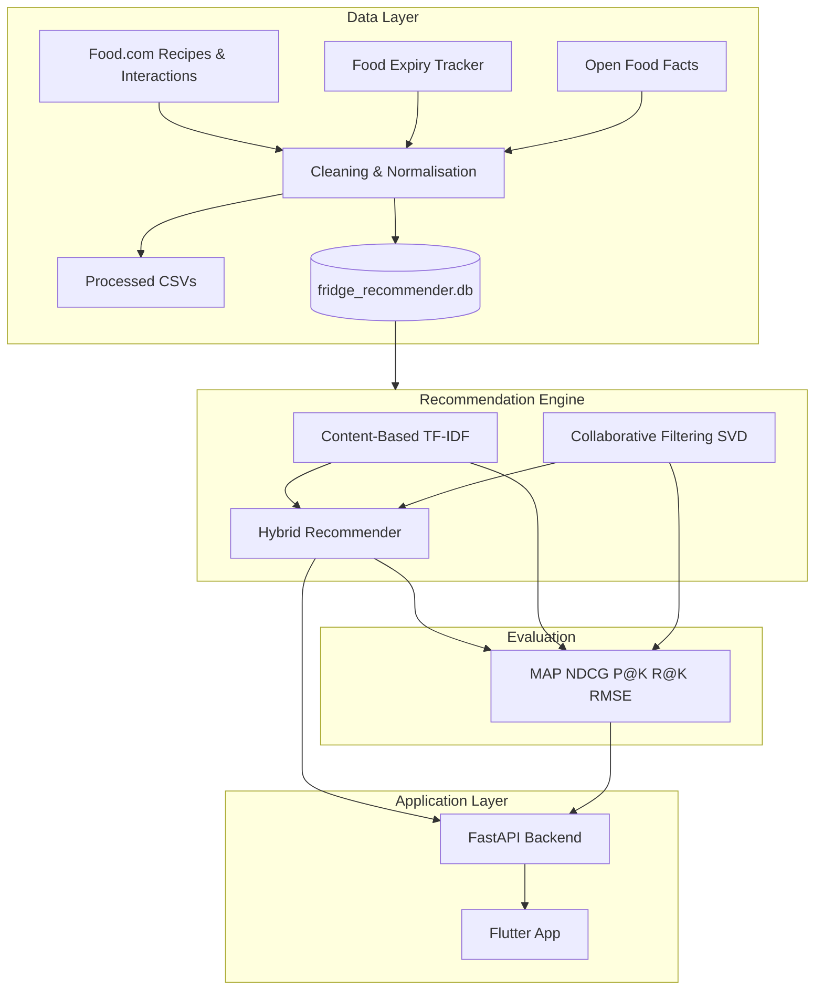

# FridgeWise AI

A hybrid recipe recommendation system that helps reduce household food waste by suggesting recipes based on what is in your fridge, which ingredients expire soon, user taste preferences, and nutrition data from packaged products.

FridgeWise combines **collaborative filtering**, **content-based ingredient matching**, **expiry-aware re-ranking**, and **nutrition scoring** into a single hybrid recommender, exposed through a **FastAPI backend** and a **Flutter mobile app**.

---

## Features

- **Fridge-aware recommendations** — ranks recipes by how well they match ingredients you already have
- **Expiry prioritisation** — boosts recipes that use items close to their use-by date
- **Personalised suggestions** — collaborative filtering on Food.com user–recipe ratings
- **Nutrition & allergen awareness** — Open Food Facts barcode lookup for packaged products
- **Cold-start support** — fallback ranking for new users and unfamiliar ingredients
- **Offline evaluation** — MAP@K, NDCG@K, Precision@K, Recall@K, and RMSE across three model variants
- **Mobile prototype** — Flutter app connected to a Python recommendation API

---

## Architecture



---

## Tech Stack

| Layer | Technologies |
|-------|--------------|
| Data processing | Python, Pandas, NumPy |
| Machine learning | scikit-learn, Surprise (SVD) |
| Storage | SQLite, CSV |
| API | FastAPI, Uvicorn |
| Mobile | Flutter, Dart |
| External data | Kaggle datasets, [Open Food Facts API](https://openfoodfacts.github.io/openfoodfacts-server/api/tutorial-off-api/) |

---

## Repository Structure

```
FridgeWise-AI/
├── api/
│   └── main.py                      # FastAPI recommendation service
├── config/
│   └── config.yaml                  # Paths, model weights, evaluation settings
├── data/
│   ├── raw/                         # Raw Kaggle downloads (gitignored)
│   ├── processed/                   # Cleaned CSVs and evaluation results
│   ├── cache/                       # Cached API responses (gitignored)
│   └── fridge_recommender.db        # SQLite database (gitignored)
├── flutter_app/
│   ├── lib/
│   │   ├── main.dart
│   │   ├── screens/                 # Fridge, recommendations, recipe detail, barcode
│   │   └── services/api_service.dart
│   └── pubspec.yaml
├── scripts/
│   ├── build_dataset.py             # End-to-end data pipeline
│   ├── train_and_evaluate.py        # Train models and run offline evaluation
│   ├── download_data.py             # Download Kaggle datasets
│   └── verify_database.py           # Validate SQLite contents
├── src/
│   ├── preprocessing/
│   │   ├── ingredient_utils.py      # Normalisation, synonyms, cold-start mappings
│   │   ├── clean_recipes.py
│   │   ├── clean_interactions.py
│   │   ├── clean_interaction_splits.py
│   │   ├── clean_expiry.py
│   │   ├── fetch_open_food_facts.py
│   │   ├── build_fridge_inventory.py
│   │   ├── build_integrated_dataset.py
│   │   └── build_database.py
│   ├── models/
│   │   ├── content_based.py         # TF-IDF + ingredient overlap baseline
│   │   ├── collaborative_filtering.py
│   │   └── hybrid_recommender.py
│   └── evaluation/
│       ├── metrics.py               # MAP, NDCG, Precision, Recall
│       └── evaluate.py
├── requirements.txt
└── README.md
```

---

## Datasets

| Source | Purpose |
|--------|---------|
| [Food.com Recipes & Interactions](https://www.kaggle.com/datasets/shuyangli94/food-com-recipes-and-user-interactions) | Recipe catalogue, user ratings, collaborative filtering, offline evaluation |
| [Food Expiry Tracker](https://www.kaggle.com/datasets/prekshad2166/food-expiry-tracker) | Expiry prioritisation and food-waste reduction signals |
| [Open Food Facts](https://world.openfoodfacts.org/data) | Barcode lookup, nutrition values, allergens, Nutri-Score |

**Integration:** The three sources do not share a common ID. FridgeWise links them through **ingredient-level matching** — names are cleaned, lowercased, normalised, and mapped to canonical forms before joining (see `src/preprocessing/ingredient_utils.py`).

**Example normalisations:**

| Raw | Normalised |
|-----|------------|
| tomatoes | tomato |
| cheddar cheese | cheese |
| Greek yogurt | yogurt |
| whole wheat pasta | pasta |

---

## Data Outputs

Running the pipeline produces seven processed CSV files and one SQLite database.

### CSV files (`data/processed/`)

| File | Description |
|------|-------------|
| `clean_recipes.csv` | Parsed ingredients, dietary/cuisine tags, difficulty |
| `clean_interactions.csv` | Filtered Food.com ratings (1–5) |
| `clean_interactions_train.csv` | Training split for CF |
| `clean_interactions_validation.csv` | Validation split for hyperparameter tuning |
| `clean_interactions_test.csv` | Test split for final metrics |
| `clean_expiry_items.csv` | Expiry items with priority scores |
| `clean_open_food_products.csv` | Cached Open Food Facts products |
| `user_fridge_inventory.csv` | Synthetic fridge inventories (demo users) |
| `recipe_ingredient_features.csv` | Recipe–ingredient bridge with expiry/nutrition features |
| `final_recommendation_dataset.csv` | User–recipe modelling dataset with hybrid scores |
| `evaluation_results.json` | Offline metric results for all three models |

### SQLite database (`data/fridge_recommender.db`)

Tables: `recipes`, `interactions`, `expiry_items`, `open_food_products`, `user_fridge_inventory`, `recipe_ingredient_features`, `final_recommendation_dataset`

---

## Getting Started

### Prerequisites

- Python 3.10+
- [Kaggle API credentials](https://www.kaggle.com/docs/api) (for dataset download)
- Flutter SDK (optional, for mobile app)

### Installation

```bash
git clone https://github.com/nadeeshaJ/FridgeWise-AI.git
cd FridgeWise-AI
pip install -r requirements.txt
```

### 1. Download raw data

```bash
python scripts/download_data.py
```

Place manually if needed:
- `data/raw/RAW_recipes.csv`
- `data/raw/RAW_interactions.csv`
- `data/raw/interactions_train.csv`, `interactions_validation.csv`, `interactions_test.csv`
- `data/raw/food_expiry_tracker.csv`

### 2. Build the integrated dataset

```bash
python scripts/build_dataset.py
python scripts/verify_database.py
```

### 3. Train and evaluate recommenders

```bash
python scripts/train_and_evaluate.py
```

Results are written to `data/processed/evaluation_results.json`.

### 4. Run the API

```bash
python api/main.py
```

API runs at `http://localhost:8000`. Endpoints:

| Method | Endpoint | Description |
|--------|----------|-------------|
| GET | `/health` | Service health check |
| GET | `/demo-users` | List available demo user IDs |
| GET | `/users/{id}/fridge` | Fridge inventory for a user |
| GET | `/users/{id}/recommendations?top_k=10` | Hybrid recipe recommendations |
| GET | `/recipes/{id}` | Full recipe details |
| GET | `/products/{barcode}` | Open Food Facts product lookup |

### 5. Run the Flutter app

```bash
cd flutter_app
flutter pub get
flutter run
```

Use `http://10.0.2.2:8000` as the API base URL on Android emulator; use your machine's LAN IP on a physical device.

Demo users: `10001`–`10040` (synthetic fridges with mixed expiry dates and cold-start ingredients).

---

## Data Pipeline

The pipeline is orchestrated by `scripts/build_dataset.py` in nine stages:

| Stage | Script / module | Output |
|-------|-----------------|--------|
| 1 | `download_data.py` | Raw files in `data/raw/` |
| 2 | `clean_recipes.py` | `clean_recipes.csv` |
| 3 | `clean_interactions.py` | `clean_interactions.csv` |
| 3b | `clean_interaction_splits.py` | `clean_interactions_{train,val,test}.csv` |
| 4 | `clean_expiry.py` | `clean_expiry_items.csv` |
| 5 | `fetch_open_food_facts.py` | `clean_open_food_products.csv` |
| 6 | `build_fridge_inventory.py` | `user_fridge_inventory.csv` |
| 7 | `build_integrated_dataset.py` | `recipe_ingredient_features.csv`, `final_recommendation_dataset.csv` |
| 8 | `build_database.py` | `fridge_recommender.db` |

Adjust subset sizes and weights in `config/config.yaml`.

---

## Preprocessing Details

### Recipes (`clean_recipes.csv`)

- Parse Food.com ingredient lists (stringified Python lists)
- Normalise ingredient names via `ingredient_utils.py`
- Extract `dietary_tags`, `cuisine_tags`, `difficulty_level` from recipe tags
- Columns: `recipe_id`, `recipe_name`, `minutes`, `cleaned_ingredients`, `tags`, etc.

### Interactions

- Keep ratings 1–5; drop rows with missing `user_id`, `recipe_id`, or `rating`
- Inner join on valid `recipe_id` from the recipes table
- Preserve official train / validation / test splits from Food.com

### Expiry items (`clean_expiry_items.csv`)

The Food Expiry Tracker uses a **one-hot schema** (`item_dairy`, `item_vegetable`, `storage_fridge`, `days_until_expiry`, etc.). The cleaner:

1. Derives category and representative ingredient from one-hot flags
2. Maps storage flags to `fridge`, `freezer`, or `pantry`
3. Converts normalised `days_until_expiry` (0–1) to calendar days using category shelf-life
4. Computes `expiry_priority_score`:

| days_to_expiry | expiry_priority_score |
|----------------|----------------------|
| ≤ 0 | 1.0 |
| ≤ 2 | 0.9 |
| ≤ 5 | 0.7 |
| ≤ 10 | 0.5 |
| otherwise | 0.2 |

### Open Food Facts products

- Fetches products by category search and known barcodes
- Caches responses in `data/cache/open_food_facts_cache.json`
- Maps product names to `generic_ingredient_name` (e.g. Cheddar → cheese)
- Computes `nutrition_score` (penalises high sugar/sat fat/salt; rewards protein/fibre)

### Fridge inventory

- Generates 40 synthetic users (`10001`–`10040`)
- Samples common Food.com ingredients plus cold-start items (`miso`, `tempeh`, `kimchi`, `plantain`, etc.)
- Links ~30% of items to Open Food Facts barcodes

### Ingredient normalisation (`ingredient_utils.py`)

Foundation for all matching:

- Lowercase, strip punctuation, remove quantity prefixes
- Synonym dictionary (`cheddar cheese` → `cheese`)
- Simple plural handling (`tomatoes` → `tomato`)
- Cold-start mappings (`tempeh` → `tofu`, `cassava` → `potato`)

---

## Recommender Models

### Model 1 — Content-Based Filtering (Baseline)

**Method:** TF-IDF vectorisation on `cleaned_ingredients` combined with ingredient overlap score.

**Use cases:**
- Rank recipes against a user's fridge contents (app)
- Rank against a taste profile built from highly rated recipes (offline evaluation)
- Strong when no interaction history exists (new recipes, cold-start users)

**Implementation:** `src/models/content_based.py`

---

### Model 2 — Collaborative Filtering

**Method:** Item-based KNN (cosine similarity on the user–item matrix), selected after validation tuning. SVD is also supported as an alternative.

**Output:** Predicted rating per user–recipe pair.

**Tuning:** `src/models/tune_cf.py` compares KNN and SVD on the validation split, optimising hit-rate@10 (ranking) alongside RMSE. Best config is saved to `config/cf_best.json` and loaded by the API.

**Selected model:** item-based KNN with `k=40` (validation hit@10 = 0.60, validation RMSE ≈ 0.90).

**Implementation:** `src/models/collaborative_filtering.py`, `src/models/tune_cf.py`

---

### Model 3 — Hybrid Recommender

Combines all signals into a single ranking score. This is the **production model** used by the API and Flutter app.

**Standard formula:**

```
final_hybrid_score =
  0.35 × ingredient_match_score
+ 0.30 × predicted_rating_normalised
+ 0.20 × expiry_priority_score
+ 0.15 × nutrition_score
```

**Cold-start formula** (user with no rating history):

```
final_hybrid_score =
  0.50 × ingredient_match_score
+ 0.30 × expiry_priority_score
+ 0.20 × nutrition_score
```

Weights are configurable in `config/config.yaml`.

**Implementation:** `src/models/hybrid_recommender.py`

---

## Evaluation

### Splits

| Split | File | Use |
|-------|------|-----|
| Train | `clean_interactions_train.csv` | Fit CF and build content profiles |
| Validation | `clean_interactions_validation.csv` | Tune hyperparameters |
| Test | `clean_interactions_test.csv` | Report final metrics |

### Metrics

| Metric | Description |
|--------|-------------|
| **MAP@K** | Mean Average Precision at K |
| **NDCG@K** | Normalised Discounted Cumulative Gain at K |
| **Precision@K** | Fraction of top-K recommendations that are relevant |
| **Recall@K** | Fraction of relevant items found in top-K |
| **RMSE** | Root Mean Square Error for CF rating prediction |

Evaluated at **K = 5** and **K = 10** for all three models. Positive interactions defined as rating ≥ 4.

### Protocol

1. Train CF on the train split; tune KNN vs SVD on validation (`scripts/train_and_evaluate.py` step 1)
2. For each test user, rank held-out positive recipes against sampled negatives
3. Compare content-based, CF, and hybrid recommendation lists
4. Save results to `data/processed/evaluation_results.json`

**Hybrid offline protocol:** CF-first rank fusion — CF top-K list merged with content-based hits so collaborative signal is preserved while content can surface additional relevant recipes.

```bash
python scripts/train_and_evaluate.py
```

### Latest results (test split, 30 users, LOO)

| Model | P@5 | R@5 | MAP@5 | NDCG@5 | P@10 | R@10 |
|-------|-----|-----|-------|--------|------|------|
| Content-based | 0.007 | 0.033 | 0.033 | 0.033 | 0.003 | 0.033 |
| Collaborative filtering | 0.113 | 0.567 | 0.517 | 0.530 | 0.057 | 0.567 |
| **Hybrid** | **0.120** | **0.600** | **0.550** | **0.563** | **0.060** | **0.600** |

CF rating prediction: test RMSE ≈ **0.93** (KNN, k=40).

Leave-one-out evaluation produces conservative absolute scores; compare models relatively. Content-based acts as a cold-start baseline; hybrid improves on CF by blending content signals without degrading collaborative ranking.

---

## Cold-Start Handling

| Scenario | Detection | Strategy |
|----------|-----------|----------|
| **New user** | No interaction history | Cold-start hybrid formula (fridge + expiry + nutrition only) |
| **New recipe** | No ratings in training data | Content-based features (ingredients, tags, cook time) |
| **New barcode product** | Unknown barcode | Map via Open Food Facts → generic ingredient |
| **Unfamiliar ingredient** | Not in training vocabulary | Synonym / category mapping in `ingredient_utils.py` |

**Example cold-start ingredient mappings:**

| Ingredient | Mapped to |
|------------|-----------|
| tempeh | tofu |
| cassava | potato |
| miso | soy sauce |
| kimchi | cabbage |
| plantain | banana / potato |

---

## Mobile App

The Flutter app (`flutter_app/`) is a functional prototype connected to the FastAPI backend.

| Screen | Description |
|--------|-------------|
| **Home** | Select a demo user |
| **Fridge Inventory** | View ingredients, quantities, expiry dates (colour-coded urgency) |
| **Recommendations** | Top hybrid-ranked recipes with match % and scores |
| **Recipe Detail** | Ingredients, steps, cook time, explanation of why it was recommended |
| **Barcode / Nutrition** | Enter a barcode to look up product nutrition and allergens |

---

## Configuration

Key settings in `config/config.yaml`:

```yaml
food_com:
  max_recipes: 50000          # Subset for faster prototyping; set null for full dataset

fridge_inventory:
  num_users: 40
  reference_date: "2026-06-14"

hybrid_weights:
  ingredient_match: 0.35
  predicted_rating: 0.30
  expiry_priority: 0.20
  nutrition: 0.15

evaluation:
  k_values: [5, 10]
  max_eval_users: 30
  min_rating_for_positive: 4
```

---

## Development Roadmap

| Area | Status | Next steps |
|------|--------|------------|
| Data pipeline | Complete | Optional: full Food.com dataset |
| Expiry integration | Complete | — |
| Content-based model | Complete | — |
| Collaborative filtering | Complete | KNN k=40 selected via validation tuning |
| Hybrid model | Complete | CF-first rank fusion for offline eval; weighted formula for app |
| Offline evaluation | Complete | MAP@5 0.55 (hybrid), NDCG@5 0.56 on test split |
| FastAPI backend | Complete | Add auth, caching |
| Flutter app | Prototype | Barcode camera, manual ingredient entry |
| Ingredient matching | Ongoing | Expand synonym dictionary |

---

## Known Limitations

- **Ingredient matching** — fuzzy normalisation reduces but does not eliminate mismatch errors between datasets
- **Synthetic fridges** — demo users (`10001`–`10040`) are generated; not linked to real Food.com user IDs
- **Open Food Facts API** — subject to rate limits and outages; products are cached locally
- **Evaluation difficulty** — leave-one-out test set makes absolute MAP/NDCG scores conservative; compare models relatively
- **Nutrition score** — simplified heuristic; not a substitute for dietary or medical advice

---

## Contributing

1. Fork the repository
2. Create a feature branch
3. Make changes with clear commit messages
4. Run `python scripts/build_dataset.py` and `python scripts/train_and_evaluate.py` to verify
5. Open a pull request

---

## License

This project is provided for educational and research purposes. Dataset licenses apply to Food.com, Food Expiry Tracker, and Open Food Facts data respectively.
